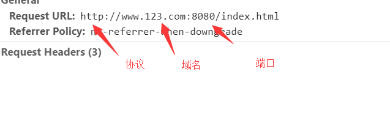

# 跨域
### *跨域是什么？*

		在浏览器需要执行其他网站的脚本或者在其他网站请求数据，但是由于浏览器的同源策略存在，所以产生了跨域。

同源策略：
	浏览器规定了如果两个 url 的**协议**、**域名**、**端口**中有任何一个不等，就认定它们跨源了。




当浏览器认定你跨源后，你将：

	不能获取Cookie、LocalStorage、IndexedDB；
	不能获取 dom 节点；
	不能进行一般的 Ajax 通信；
所以这时我们就需要跨域了。通用的几种跨域方法
##### 1 . JSONP 跨域

利用 script 标签，和 img 标签。（这些标签是不受同源策略限制的）JSONP 的核心就是通过动态加载 script 标签和img 标签的src属性，
来完成对目标 url 的请求。
但由于标签的性质，只支持GET请求
例：

	function handleResponse(res) {
	   // 回调函数，处理返回到的数据
	}
	const script = document.createElement('script')
	script.src = 'http://127.0.0.1:3000?callback=handleResponse'
	document.head.appendChild(script)


##### 2 . CORS 跨域
CORS( **Cross-Origin Resource Sharing** )，这种跨域较为常见，
具体就是：

	当前端与后端进行 Ajax 通信时，通过自定义 HTTP 头部设置从而决定请求或响应是否生效
例如：（本url 为  ```http://localhost:3001```）

	const xhr = new XMLHttpRequest()
	xhr.onreadystatechange = function () {
	  if (xhr.readyState === 4) {
	    if (xhr.status >= 200 && xhr.status < 300 || xhr.status === 304) {
	      console.log('res:' + xhr.responseText)
	    }
	  }
	}
	xhr.open('get', 'http://localhost:3000', true)
	xhr.send()
在浏览器发送请求的时候就会多出一行代码

	Origin: http://localhost:3001
但是在控制台依旧会报错

	 'Access-Control-Allow-Origin' header is present on the requested resource. Origin 'http://localhost:3001' is therefore not allowed access.

这时我们需要在后台设置 'Access-Control-Allow-Origin' 这个字段，它的作用就是设置允许来自什么源的请求，

同时cors  还支持put,delete 等预请求。详见 [CORS](https://developer.mozilla.org/zh-CN/docs/Web/HTTP/Access_control_CORS)


##### 3 . 代理
浏览器存在跨域的问题，但服务器不存在这个问题的，所以我们可以配置服务器，来达到跨域的目的


例如：源址 ``` www.123.com/index.html ```

	为了数据，需要调用www.456.com/server.php这个接口，
	这时后台可以写一个接口www.123.com/server.php，
	由这个接口在后端去调用www.456.com/server.php并拿到返回值，
	然后再返回给index.html。

这就是一个代理的模式。相当于绕过了浏览器端，自然就不存在跨域问题。

##### 4 . WebSockets
WebSockets 属于 HTML5 的协议，它的目的是在一个持久连接上建立全双工通信。由于 WebSockets 采用了自定义协议，所以优点是客户端和服务端发送数据量少，缺点是要额外的服务器。基础的使用方法如下：

	const ws = new WebSocket('ws://127.0.0.1:3000')
	ws.onopen = function() {
	  // 连接成功建立
	}

	ws.onmessage = function(event) {
	  // 处理数据
	}

	ws.onerror = function() {
	  // 发生错误时触发，连接中断
	}

	ws.onclose = function() {
	  // 连接关闭时触发
	}
也可以使用封装好的库    socket.io
